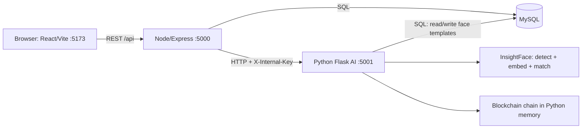

# BlockBioVote – Project Guide

A guide to how this repository actually works, written so you can explain it to your guide.
Everything below describes the code in this repository; items that do not exist are listed under *Limitations*.

## 1. Overview
BlockBioVote is an academic prototype of an electronic voting system. A voter registers with details and a webcam capture; at voting time the system recognises the voter's face, allows one vote, and appends the vote to a hash-linked chain (a simple blockchain) that an administrator can inspect.

## 2. Problem statement
Manual and password-based voting is open to impersonation, double voting and records that are hard to verify. The project explores: identify the voter biometrically, enforce one vote per voter, and keep a tamper-evident record.

## 3. Objectives
- Biometric voter registration and authentication (face).
- One vote per registered voter, enforced server-side.
- Tamper-evident vote records (SHA-256 hash chain) with an integrity check.
- Separate voter and admin/auditor portals; audit trail of key events.

## 4. Technology stack and why
| Technology | Role in this project |
|---|---|
| React + Vite | Single-page frontend (pages, routing, webcam capture). Vite is the dev server/bundler. |
| Node.js + Express | REST API; validation, business rules (one vote), admin authentication, talks to MySQL and the AI service. |
| Python + Flask | AI service: face analysis and the blockchain. |
| InsightFace (ONNX Runtime, OpenCV) | Face detection and 512-number face embeddings (ArcFace family) – "face recognition". |
| MySQL | Voters, candidates, audit log. |
| SHA-256 (hashlib) | Block hashing for the chain. |
| scrypt / HMAC (Node crypto) | Admin password hashing and signed admin tokens. |
| Fernet (cryptography) | Encrypts face embeddings stored in the database. |

## 5. Architecture

Notes from the code: the Python service also connects to MySQL (to store and read encrypted face templates). The browser never talks to the Python service; the admin Blockchain page reads the chain through Node (`GET /api/admin/blockchain`).

## 6. Frontend (`client/src`)
- `main.jsx` loads `App.css` and `theme.css` (dark design system). `App.jsx` holds all routes.
- `api.js` – API base URLs (`VITE_API_URL`, `VITE_AI_URL`), the admin axios instance (adds the token, returns to login on 401).
- `voterSession.jsx` – in-memory voter state (typed Voter ID, verified voter, receipt). Cleared on refresh/logout.
- Pages: `Home` (landing), `VoterLogin`, `Register`, `Vote` (reused in two modes: face `auth`, candidate `vote`), `VoterDashboard`, `AdminLogin`, `Blockchain`, `Results`, and `pages/admin/*` (Dashboard, Candidates, Voters, Voting, Election, Audit).
- Components: `PublicHeader`, `AdminLayout` (sidebar/drawer + route guard), `useLoad` (loading/error helper).
- Admin token is kept in `sessionStorage` (cleared when the tab closes).

| Route | Page |
|---|---|
| `/` | Landing |
| `/voter/login` → `/voter/authenticate` → `/voter/dashboard` → `/voter/vote` | Voter flow (`/voter/register` for registration) |
| `/admin/login` → `/admin` (`election`, `candidates`, `voters`, `voting`, `audit`, `blockchain`, `results`) | Admin/auditor |
| `/register`, `/vote`, `/results`, `/blockchain` | Redirect to the routes above |

## 7. Backend (`server/`)
- `server.js` – Express app, CORS, JSON body (10 MB), health check `/api/health`, mounts routers.
- `routes/voterRoutes.js` – register, check-face, register-face, authenticate, list voters.
- `routes/voteRoutes.js` – cast vote, candidates, results.
- `routes/adminRoutes.js` – admin login, audit logs.
- `config/db.js` (MySQL pool), `config/ai.js` (client for the Python service, sends the internal key), `config/adminAuth.js` (scrypt check + signed token), `middleware/requireAdmin.js`.
- `scripts/setup-admin.js` – writes admin credentials into `server/.env`; `scripts/migrate.js` – adds newer columns to old databases.

## 8. Database (`database/schema.sql`, name `securevoteai`)
| Table | Purpose | Key fields |
|---|---|---|
| `voters` | Registered voters | `voter_id` (PK), `name`, `age`, `is_eligible`, `has_voted`, `face_encoding` (encrypted embedding), `face_registered_at` |
| `candidates` | Candidates and tallies | `candidate_id` (PK), `name`, `party`, `symbol`, `vote_count` |
| `audit_log` | Event trail | `id`, `voter_id`, `action`, `timestamp` |
There are no foreign keys, no election table and no votes table; the vote itself is recorded as a block in memory plus the `vote_count` / `has_voted` counters.

## 9. AI / face authentication (`python_ai/face_module.py`)
```
Webcam frame (base64 JPEG) → decode in memory → InsightFace detects faces
→ keep exactly one face (none / several are rejected)
→ quality checks: detector confidence, face size, brightness, blur, roughly frontal
→ 512-number embedding (normalised)
→ registration: 3–5 captures must be mutually similar, different frames, and not match any other voter → averaged → encrypted → stored
→ authentication: embedding compared (cosine similarity) with every stored template; best match ≥ 0.45 → voter identified
```
No images are written to disk. There is **no liveness detection**.
The Python routes `/check-face`, `/register-face`, `/authenticate`, `/add-to-blockchain` require the `X-Internal-Key` header, so only the Node server can call them.

## 10. Voting flow (`POST /api/votes/cast`)
1. Look up the voter and candidate; reject unknown voter/candidate or `has_voted`.
2. Ask the Python service to add a block (voter ID hashed, candidate name, previous hash).
3. Set `voters.has_voted = TRUE`, increment `candidates.vote_count`, write an audit row.
4. Return the receipt (block index, block hash, voter hash).

## 11. Blockchain (`python_ai/blockchain.py`)
- **Block**: index, timestamp, voter hash (SHA-256 of voter ID), candidate, previous hash, own hash.
- **Hash**: SHA-256 over those fields; **previous hash** links each block to the one before; block 0 is the genesis block.
- **Integrity check** (`is_valid`): recomputes every block's hash and checks every previous-hash link; any edit breaks it.
- The chain lives in **Python memory** and resets when the AI service restarts. There is no mining/consensus/network – it is a single-node tamper-evident log.

## 12. Audit system
`audit_log` receives: `REGISTERED`, `REGISTRATION_REJECTED:UNDERAGE`, `FACE_REGISTERED`, `FACE_REGISTRATION_FAILED:<reason>`, `AUTHENTICATED`, `DUPLICATE_ATTEMPT`, `VOTED_FOR:<candidate>`. The admin endpoint hides the candidate from the vote row. Failed authentication, candidate/election changes and block creation are not logged.

## 13. Admin authentication
Credentials are only in `server/.env` (`ADMIN_USERNAME`, `ADMIN_PASSWORD_HASH` = scrypt, `ADMIN_TOKEN_SECRET`). `POST /api/admin/login` verifies the password and returns an HMAC-signed token valid for 2 hours; five wrong attempts per IP lock that IP for 15 minutes (in memory). Admin endpoints (`/api/admin/audit-logs`, `/api/admin/blockchain`, `/api/votes/results`, `/api/voters/all`) require `Authorization: Bearer <token>` – enforced by the server, not just the UI. Create credentials with `npm run setup-admin -- "<password>"`.

## 14. Security
**Implemented:** encrypted face templates; no stored images; single-face/quality checks; duplicate-face detection; server-enforced single vote; hashed voter ID on chain; hash-chain integrity check; env-based secrets; internal key between Node and Python; scrypt admin password; signed expiring admin token; login rate limit; input validation and parameterised SQL.
**Future enhancements:** liveness detection; voter session token issued by the server after face match; atomic vote transaction; persistent chain; salted voter hash; election scheduling; candidate management; roles; HTTPS.

## 15. End-to-end example
Voter V001 registers details (`/voters/register`) → captures 3 images, each checked (`/voters/check-face`), then `/voters/register-face` stores the encrypted template → later enters V001, face is matched (`/voters/authenticate`) → dashboard → selects a candidate → `/votes/cast` adds a block and updates counters/audit → receipt shown → admin signs in and sees the vote in Voting, Results, Audit Logs (without candidate) and a new block on Blockchain.

## 16. Important files
| File / folder | Purpose |
|---|---|
| `client/src/App.jsx` | All routes |
| `client/src/api.js` | API URLs, admin token handling |
| `client/src/pages/Vote.jsx` | Face authentication + candidate selection + receipt |
| `client/src/pages/Register.jsx` | Registration (details + webcam) |
| `client/src/components/AdminLayout.jsx` | Admin shell and guard |
| `server/server.js` | Express entry point |
| `server/routes/*.js` | REST endpoints |
| `server/config/adminAuth.js` | Admin password/token logic |
| `python_ai/app.py` | Flask endpoints |
| `python_ai/face_module.py` | Detection, quality checks, matching |
| `python_ai/security.py` | Embedding encryption |
| `python_ai/blockchain.py` | Block and chain |
| `database/schema.sql` | Tables and sample candidates |
| `tests/phase3/` | Registration/authentication API tests |

## 17. How components communicate
| Step | Call |
|---|---|
| Register details | React → `POST /api/voters/register` → MySQL |
| Per-capture check | React → `POST /api/voters/check-face` → Python `/check-face` |
| Save face | React → `POST /api/voters/register-face` → Python `/register-face` → MySQL |
| Face login | React → `POST /api/voters/authenticate` → Python `/authenticate` (reads MySQL) |
| Vote | React → `POST /api/votes/cast` → Python `/add-to-blockchain` → MySQL |
| Admin login | React → `POST /api/admin/login` |
| Admin data (token required) | React → `/api/voters/all`, `/api/admin/audit-logs`, `/api/votes/results`, `/api/admin/blockchain` (Node → Python `/blockchain-status`) |
| Candidate list (voters) | React → `GET /api/votes/candidates` (public) |

## 18. Current limitations (real, from the code)
- No liveness detection: a printed photo could pass.
- `POST /api/votes/cast` trusts the `voter_id` sent by the client; the Voter ID typed at login is only cross-checked in the browser.
- Voting is not atomic: the block is added before the database update, so a failure in between leaves them inconsistent (the dashboard shows a mismatch warning).
- The chain is in memory (lost on AI-service restart). Results and chain status are admin-only; `/api/votes/candidates` is public (voters need it).
- Voter hash is unsalted SHA-256 of the voter ID (pseudonymous, guessable for known IDs); `audit_log` stores `VOTED_FOR:<candidate>` next to the voter ID (hidden in the admin API but present in the database).
- No election dates/status, no candidate add/edit/remove, no admin roles; admin login rate limit resets on server restart.
- Voter session is in memory only (refresh = log in again).

## 19. Future enhancements
Liveness detection; server-issued voter token and 1:1 face verification; transactional voting; persisted and salted chain; election management and candidate CRUD; logging of failed authentication and admin actions; HTTPS and deployment hardening.
